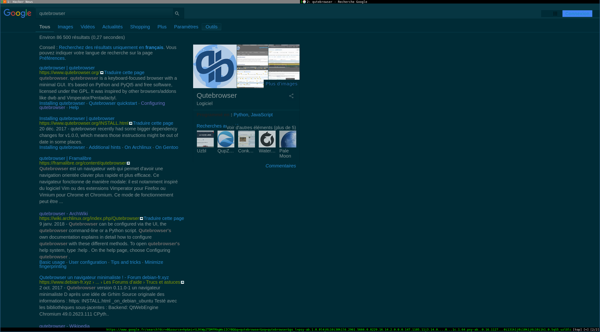
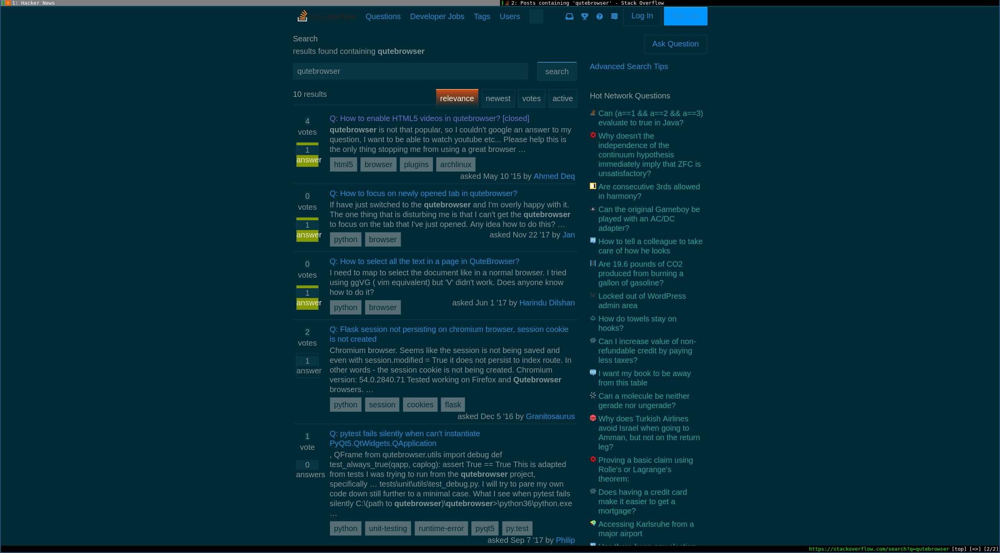
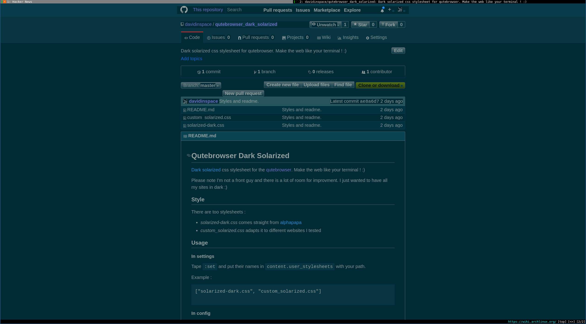
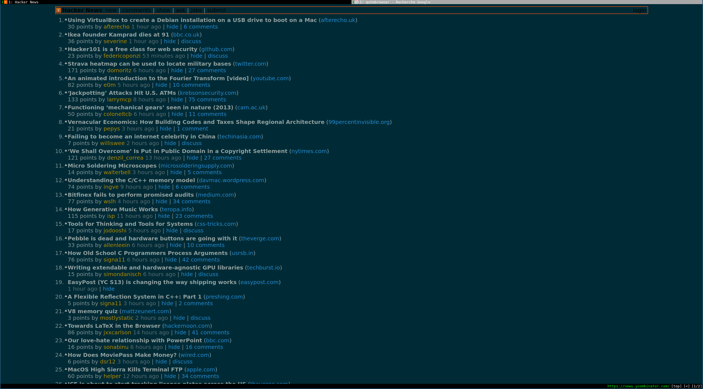
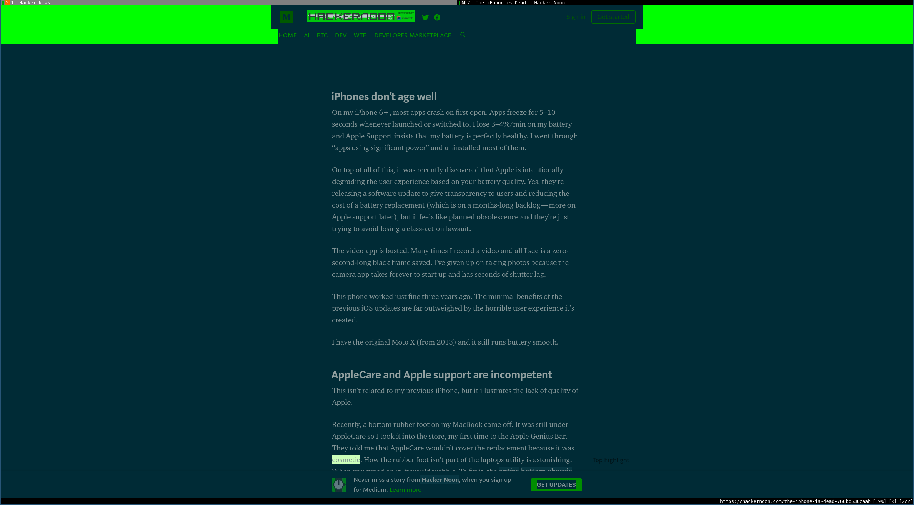
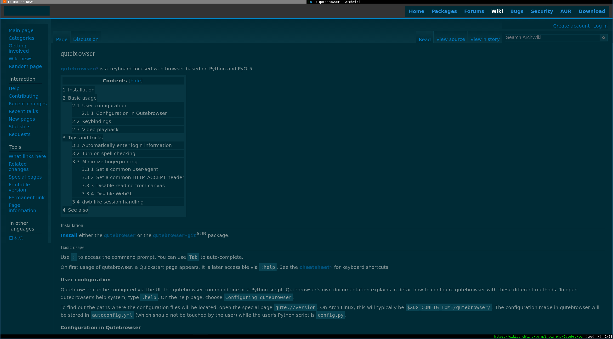
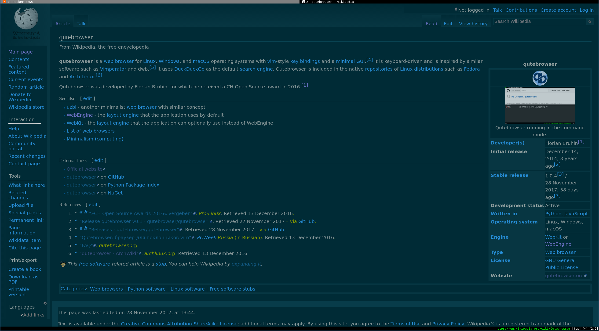

# Qutebrowser Dark Solarized

[Dark solarized](http://ethanschoonover.com/solarized) css stylesheet for the [qutebrowser](https://qutebrowser.org). Make the web like your terminal ! :)

I tried to adapt it to content sites that did not work well (documentation, media ...).

Please note I'm not a front guy and there is a lot to improve.
I just wanted to have all my sites in dark :)

## Screenshots









## Style

There are two stylesheets :
- *solarized-dark.css* comes straight from [alphapapa](https://github.com/alphapapa/solarized-everything-css)
- *custom_solarized.css* adapts it to different websites I tested


## Usage

### In settings

Tape `:set` and put their names in `content.user_stylesheets` with your path.

Example :

```
["solarized-dark.css", "custom_solarized.css"]

```

### In config

In `config.py` :

```
c.content.user_stylesheets = [
    'solarized-dark.css',
    'custom_solarized.css'
]
```

## Sites I tested

- https://www.google.com
- https://en.wikipedia.org
- https://wiki.archlinux.org
- https://docs.python.org
- https://github.com/
- https://stackoverflow.com
- https://stripe.com/docs
- https://docs.adyen.com
- http://flask.pocoo.org/docs
-  https://news.ycombinator.com/
- https://medium.com
...

## TODO

Improve the style when displays code (ex comments in git)


